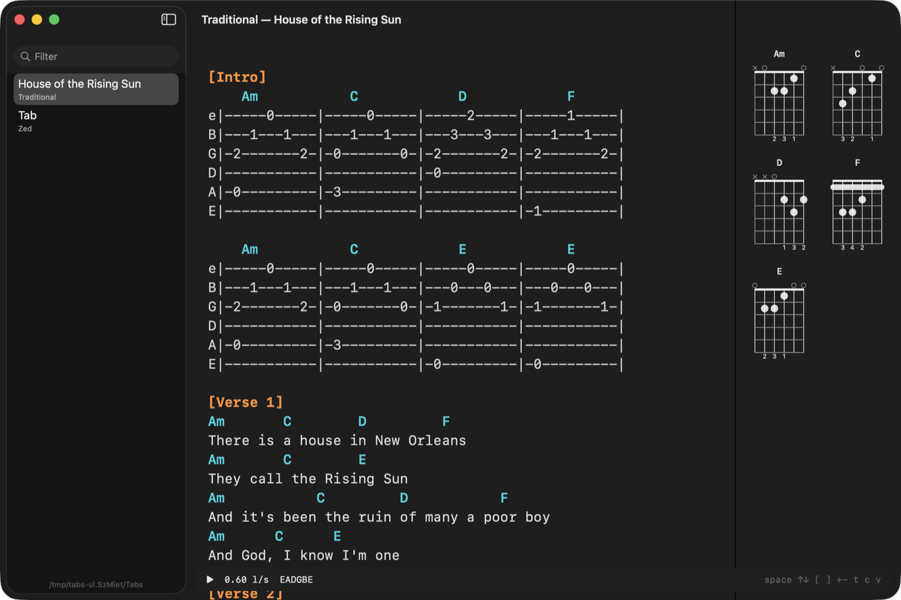

# MacTabs — an autoscrolling guitar-tab viewer for the Mac

[](https://github.com/dan-slater/mactabs/actions/workflows/build.yml) · [Download](../../releases/latest) · MIT

Put your hands on the guitar, hit space, and the tab scrolls at a speed you set once per song.
Say "faster" or "slower" to adjust it without letting go of the neck. Chord diagrams for every
chord in the song sit beside the text.



Plain text in, plain text out: a song is a `.tab` file in `~/Tabs` with a few lines of
frontmatter above ordinary ASCII tab. No account, no database, no sync. Native SwiftUI + AppKit,
one dependency ([Fretboard](https://github.com/itsmeichigo/Fretboard), MIT, for the chord
diagrams and the chords-db it bundles). Follows the system Light/Dark setting.


## Install

**Download:** grab `MacTabs.app.zip` from the [latest release](../../releases/latest), unzip, and
drop `MacTabs.app` into `~/Applications`. The app is signed ad hoc, not notarised, so the first
launch is a right-click → Open (or `xattr -d com.apple.quarantine MacTabs.app`). macOS 14 or later.

**Build from source** (Xcode command-line tools are enough):

```bash
git clone https://github.com/dan-slater/mactabs && cd mactabs
make install        # swift build → build/MacTabs.app → ~/Applications
```

`make run` builds and launches; `make` alone just builds. The app reads `~/Tabs`; set
`TABS_DIR=/path` to point it elsewhere. The folder is watched, so a file dropped in appears in
the sidebar at once.

## Keys

| Key | Does |
| --- | --- |
| space | start / stop scrolling |
| ↑ ↓ | faster / slower (×1.15 per press, saved to the file after 1.5 s) |
| [ ] | previous / next `[Section]` |
| t / 0 | back to the top |
| + − | bigger / smaller text (upper bound; lines never wrap) |
| c | show / hide the chord panel |
| n | next version of this song (when there is more than one) |
| v | voice commands on / off |

## Voice

`v` starts on-device speech recognition (Apple `Speech`; the first time macOS asks for the
microphone and speech permissions). Words that act: **faster**, **slower**, **stop** (pause,
wait), **go** (start, play, scroll), **top** (restart). Nothing leaves the Mac. Recognition
sessions are capped at about a minute, so the app rolls them over every 50 s while listening.

## The file format

`~/Tabs/<Artist> - <Title>.tab`, UTF-8, an optional frontmatter block then plain monospace text:

```
---
title: House of the Rising Sun
artist: Traditional
tuning: EADGBE
capo: 0
bpm: 80
scroll: 0.6        # lines per second; the app writes this back when you change speed
source: where it came from
---
[Intro]
    Am           C            D            F
e|-----0-----|-----0-----|-----2-----|-----1-----|
B|---1---1---|---1---1---|---3---3---|---1---1---|

[Verse 1]
Am       C        D         F
There is a house in New Orleans
```

- `[Section]` on its own line is a section header; `[` and `]` jump between them.
- A line made only of chord names (`C  G/B  Am7`) is a chord line and feeds the chord panel.
  Everything else is shown as is. Lines never wrap: the font shrinks to fit the longest line,
  down to 10 pt, and anything wider scrolls sideways.
- `scroll` is the only key the app writes. Every other key is yours; no frontmatter is fine too.
- **Versions.** Files with the same `artist` + `title` are one song: one sidebar row with a
  count badge, a picker in the toolbar, the versions in the row's right-click menu, and `n`
  cycles them. The label is the `version:` key (`UG chords 4169`, `capo 2`, `live`), else the
  `(…)` suffix of the file name. The plain `<Artist> - <Title>.tab` always sorts first. Note
  that ` #` inside a frontmatter value starts a comment, so write `UG tabs 104578`, not `#104578`.

The full example is [`tests/fixtures/sample.tab`](tests/fixtures/sample.tab).

## Getting tabs in

`tools/tab-import.py` writes a cleaned `.tab` file from the places tabs usually live. Python 3,
standard library only; the `pdf` and `scan` legs shell out to `pdftotext` / `pdftoppm` / `tesseract`
(`brew install poppler tesseract`).

```bash
T=tools/tab-import.py
python3 $T ug  'https://tabs.ultimate-guitar.com/tab/...'   # one Ultimate Guitar page
python3 $T ug  'Radiohead - Creep' [--chords]                # UG search, most-voted version
python3 $T pdf song.pdf                                      # text PDF
python3 $T scan song.pdf|png|jpg                             # scanned page (OCR; check the result)
```

Section headers are normalised to `[Section]`, `[tab]`/`[ch]` markup is stripped, capo and
tuning land in the frontmatter, and a second import of the same song becomes a version
(`<Artist> - <Title> (<version>).tab`). Flags: `--title --artist --tuning --capo --bpm --scroll
--out <dir> --dry-run`. Fetching a page from Ultimate Guitar is for your own use of a tab you
can already read in a browser; it is not an API and may break when the site changes.

If you use [Claude Code](https://claude.com/claude-code), the same script is wrapped as a `/tab`
skill in [dan-slater/daniel-dev-skills](https://github.com/dan-slater/daniel-dev-skills), so
`/tab <url>` does the import for you.

## Testing

```bash
make test        # build + the FIFO harness (19 checks; needs no focus, keep working)
make test-full   # + the real-keystroke leg (26 checks; it steals focus, leave the Mac alone)
```

`tests/ui.sh` launches the built bundle against a throwaway library and drives it two ways:

- through `TABS_TEST_FIFO`, a FIFO the app reads command words from. They go through the same
  `Voice.apply` the recogniser calls, so the voice path is tested without a microphone;
  `state` writes a JSON line (running, speed, scroll y, wrapped lines, …) to `$FIFO.out`.
- through real keystrokes with System Events (`FULL=1`; needs Accessibility for the terminal).

It also checks that the speed round-trips into the file's frontmatter, that the folder watch
picks up a new file, that versions cycle, and that no tab line wraps. Screenshots of the live
window land in `tests/shots/` (needs Screen Recording for the terminal; otherwise an in-app
render that does not apply dark mode).

## Licence

MIT. The sample tab is a traditional song in the public domain.
